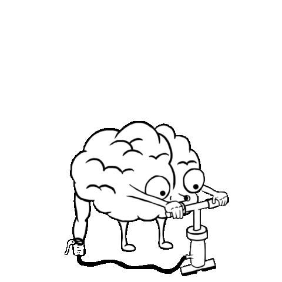

# Jamaine Roseborough
## Data Scientist, Developer, & Mentor 
</img>

### Interests
 - Applied AI in Neuroscience & Education
 - Development of software aimed to:
	 - Increase technical literacy
	 - Make learning technical concepts intuitive

### Languages & Frameworks
**Main:** Python  $\cdot$  Tensorflow  $\cdot$  OpenCV  $\cdot$  SKLearn  $\cdot$  Django  $\cdot$ Flask  $\cdot$  SQL  $\cdot$  ROS  
**Familiar:** HTML  $\cdot$  CSS  $\cdot$  JavaScript

 

> Written with [StackEdit](https://stackedit.io/).
